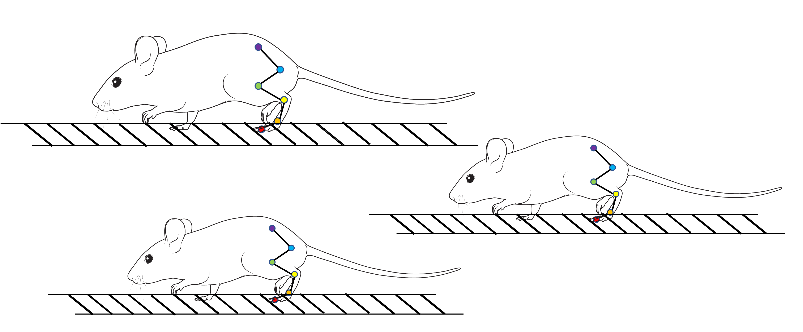

# 🖼️ KiMA Image & Asset Management Guide

## Current Project Structure

```
/Users/manojkumark/Desktop/KiMA/KiMA/
├── src/
│   ├── index.html              (Main template)
│   ├── images/                 ← All images go here
│   │   ├── kinematics.png      (36 KB)
│   │   ├── ladder.png          (46 KB)
│   │   ├── M_L.png             (138 KB) - Multiple Sample Analysis
│   │   ├── Multiple.png        (137 KB)
│   │   └── PCA.png             (76 KB)
│   ├── js/
│   │   └── index.js
│   └── styles/
│       └── main.css
├── webpack.config.js           (Build configuration)
├── package.json
├── dist/                       (Build output - auto-generated)
├── node_modules/              (Dependencies - auto-generated)
│
├── [KEEP IN ROOT FOR DATA]
├── DhanuushAug8shuffle0_50000_filtered.csv    (143 KB)
└── DhanuushAug8shuffle0_50000_Data_2.csv      (83 KB)
```

## Image Guidelines

### File Sizes (Current Assets)
| Image | Size | Type | Purpose |
|-------|------|------|---------|
| kinematics.png | 36 KB | PNG | Kinematics card demo |
| ladder.png | 46 KB | PNG | Ladder card demo |
| M_L.png | 138 KB | PNG | Multiple Sample Analysis |
| Multiple.png | 137 KB | PNG | Multiple Sample Comparison |
| PCA.png | 76 KB | PNG | PCA Analysis demo |
| **Total** | **433 KB** | - | - |

### Recommended Sizes for Web
- **Maximum image size**: 200 KB
- **Optimal size**: 50-100 KB
- **All current images**: Within safe limits ✅

### Image Formats
- **PNG**: Best for graphics, logos, diagrams ✅
- **JPG**: Best for photos
- **WebP**: Best for web (smaller file size)
- **GIF**: Only for animations

## How to Use Images in HTML

### ✅ DO THIS (Current Best Practice)
```html


```

### ❌ DON'T DO THIS (Outdated)
```html
  <!-- Old way -->
  <!-- Confusing -->
```

## Adding New Images

### Step 1: Prepare Image
- Optimize size (aim for < 150 KB)
- Use PNG for diagrams/graphics
- Use JPG for photos
- Recommended: 72 DPI for web

### Step 2: Place in Correct Location
```bash
# Copy image to src/images/ folder
cp your-image.png /Users/manojkumark/Desktop/KiMA/KiMA/src/images/
```

### Step 3: Use in HTML
```html

```

### Step 4: Webpack Handles Rest
- ✅ Automatically copies to dist/
- ✅ Optimizes if needed
- ✅ Generates hash for cache busting
- ✅ Works in production build

## Data Files (CSV)

### Location: Project Root
```
/Users/manojkumark/Desktop/KiMA/KiMA/
├── DhanuushAug8shuffle0_50000_filtered.csv
└── DhanuushAug8shuffle0_50000_Data_2.csv
```

### Reference in JavaScript
```javascript
fetch('DhanuushAug8shuffle0_50000_filtered.csv')
  .then(response => response.text())
  .then(data => { /* process CSV */ });
```

## Build & Deployment

### Development (npm start)
- Images served from memory
- Hot reload enabled
- All sizes: 357 KB images + 226 KB data

### Production (npm run build)
- Images optimized & copied to dist/
- CSS/JS minified
- Ready for deployment
- Total size: ~233 KB (minified)

## File Size Reference

### Project Root
```
Total size: 244 MB (mainly node_modules for development)
```

### Production Build (dist/)
```
- main.[hash].js        ~10.8 MB (includes Plotly.js)
- index.html            ~135 KB
- images/*.png          ~357 KB
- csv files             ~226 KB
Total: ~11.3 MB (one-time download)
```

### Optimization Tips
1. **Compress images**: Use ImageOptim or TinyPNG
2. **Use WebP**: Smaller file size than PNG/JPG
3. **Lazy load**: Load images only when needed
4. **Responsive**: Serve different sizes for mobile/desktop

## Troubleshooting

### Image Not Showing?
1. Check path: `src="images/filename.png"` (not `src="filename.png"`)
2. Check file exists: `ls -lh src/images/`
3. Restart server: `npm start`
4. Clear browser cache: `Cmd+Shift+R` (Mac) or `Ctrl+Shift+R` (Windows)

### Image File Size Too Large?
1. Compress with ImageOptim (Mac) or TinyPNG
2. Convert PNG to WebP for smaller size
3. Use JPG for photographs

### Build Failing?
1. Check webpack.config.js: `grep -n "asset/resource" webpack.config.js`
2. Check images folder exists: `ls src/images/`
3. Ensure no special characters in filenames

---

**Setup Date**: December 2025
**Status**: ✅ Configured & Optimized
**Next Step**: Add more images to `src/images/` as needed
